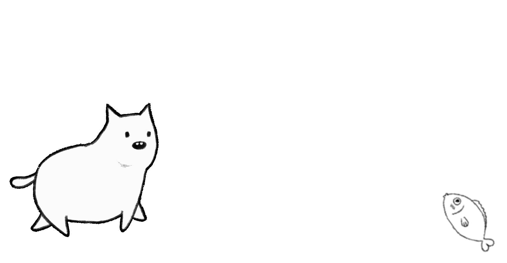
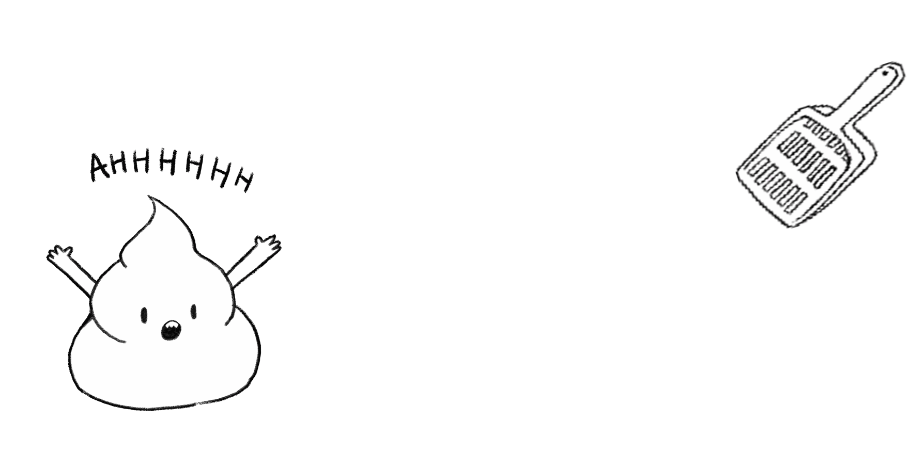

# JQuery小遊戲

----
使用Jquery做的小遊戲，用sweet alert 2發送通知，將使用者分數存在local storage.

This is a simple game made with Jquery. User score is stored in local storage, sends notice with sweet alert 2.

----

## 遊戲規則 Rules

餵貓
Feed the cat!

鏟屎
Pick up the poo!
